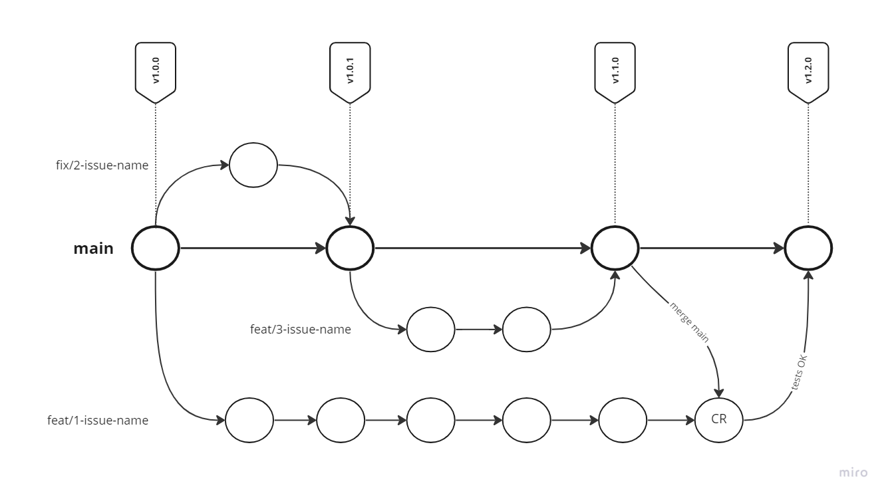
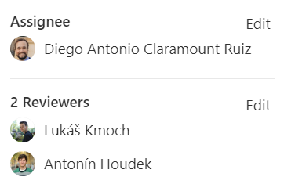
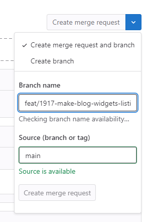

# 🪵 Git Strategy

# 💡 The `main` Idea

The main idea is that there is only one protected `main` branch. This branch contains code that has been thoroughly tested, [code reviewed](#h-code-reviews), and is considered stable and ready for deployment to production at any time. All developers create feature or hotfix branches as needed, and these branches are merged directly into the `main` branch. There are no separate development or staging branches in this approach.

 

## **Single Repository**

We will use a single repository that will contain all code for the project, including frontend, backend, and infrastructure. The structure of the repository is described in the [Blueprint document](https://iguana.wiki./../Development%20Blueprint.md#h-✊-single-repository). The main reason for using a single repository is to better sync changes between teams.

# 🪵 Branches

The new Strategy is inspired by [**Trunk Based Development**](https://trunkbaseddevelopment.com/)**.** The Trunk is in our case called `main`.

The only types of branches which are allowed to be created are **Feature and Hotfix branches**. Both work basically the same. We do not use *Release branches*! The deploys are done directly from the Trunk.

The main goal is to have **small and short-lived branches** and thus being able to do **releases fast and often**. We do not have a hard limit set for how long the branch can live, but the goal is to strive for atomic tasks. This is journey begins with creating smaller Issues in the [specification phase](https://iguana.wiki./Specifications.md#h-general-development-flow).

## **Feature branches**

Every new feature should be developed as separate issue in it's own branch

* Branch name is always in format `feat/{issue-id}-{issue-name}`
  * Example: `feat/1786-availability-calendar`
  * GitLab -> Settings -> Repository -> Branch default -> Set Branch name template to feat/%{id}-%{title}

At the end of development every branch has to pass code review from BE or FE or from both.

## **Hotfix branches**

The process is the same as with the Feature branches. 

* Resolving Hotfixes has higher priority than the Feature branches
* Branch name is always in format `fix/{issue-id}-{issue-name}`
* Fix has to be covered by new test!
* Issue Assignee should deploy the fix to the Production

# ↩️ Merge Requests

Because everything should be **Code Reviewed** and tested before deploying to the production, every Feature branch should be merged to `main` via Merge Request (MR).

## Merge Request Roles


1. **Issue Assignee**

   Developer of the Issue, is responsible to implement the issue and resolve all the feedback from the *Reviewer*. 
   * There might be multiple developers assigned to the issue. For example one from BE and one from FE.
   * If there is multiple developers it's important to assign every merge request comment/feedback to one of them.
2. **MR Assignee**\nMerge Request Assignee is responsible for the entire feature. The assignee performs the last final tests and merges the branch to the `main`. 

   
   * Assignee of the MR is not necessarily always the same person as the Assignee of Issue
     * For example the Issue might be developed by a junior developer and the *MR Assignee* should be a more experienced developer.
   * *MR Assignee* is responsible for running all the tests (and possibly blames the *Reviewer*)
   * He should mark the Issue with label `State: 4. On Main` when he merges the MR to `main`.
3. **Reviewer**\nChecks if the code is well structured and the implementation follows specification.

##  How to create a Merge Request (MR)

Merge request can be created either **from Issue** detail (using *Create merge request* button). The button automatically creates Branch and redirects you to Merge Request form.

Or you can create everything **manually**:


1. Create the branch using git
2. Create the MR in GitLab
3. Link the MR to Issue

### Merge Request requirements


1. The **Branch** must be [**named correctly (see above**](https://iguana.wiki/doc/git-strategy-M1xUJueyIR#h-branches)**).**
2. The Merge Request **status** must be tracked with **Label** `CR State` to reflect in what state the merge request is (see [Labels](./Issue%20Labels.md)).

   
:::info
   Note, that when creating Merge Request using Create merge request button the Labels are copied over from the Issue to Merge Request. These labels should not be part of Merge Request, however, the severity labels can be used for highlighting the priority (`Critical|High|Low`).

   :::
3. The **Merge Request** **title** should be same as the Issue it is linked to.
4. The Merge Request must be **linked to corresponding Issue** (if an Issue exists).

## **Code Reviews**

Code Review (CR) is done within both BE and FE in the branch. Specific developers are assigned to MRs as the Reviewers.

There is a separate document on [how to do Code Reviews](./Code%20Reviews.md).


:::info
Code Reviews always has the **highest priority** and as such is always **done at the beginning of the day**, after Daily stand up at a designated time *(every developer should reckon with CR in the daily plan).*

:::


:::tip
Before the last round of Code Review and the tests, it is important to **merge** `main` **to the Feature branch**.

:::

## How to resolve Merge Requests

As it is explained in [Issue Lifecycle flow](./Issue%20Labels.md#h-issue-lifecycle-flow), the MR can be merged to `main` and therefore **marked as resolved only when**:


1. Code Reviews are approved by all Reviewers
2. QA (and UAT) on linked Issue has passed

### Responsibilities of the MR Assignee

* ==TODO== @[Lukáš Kmoch](mention://9a5dcbd0-c5d5-47b9-8f5f-0f20b3818ea9/user/7da90c1d-cb5b-4a2a-a6c1-458d6ba5d156)
* Code is **ready to be deployed to Production**
* All **tests are passing**
* If there are multiple **Reviewers**, all of them need to **approve** the MR before merging
* All **commit messages** are according to the *Conventional Commits*
  * On small MRs all commits can be squashed to one, if it makes sense
  * For larger merges, the MR Assignee is responsible for tidying up the commits. That work can be assigned to the Issue Assignees.
* All **Threads** in the MR needs to be **marked as resolved** (should be marked as resolved by the Author of that Thread

# ✉️ Commit Messages

All commit messages must be written according to the [Conventional Commits specifications](https://www.conventionalcommits.org/).

In addition to that, the `<description>` of the message **must conform** there rules:

* Use the **imperative**, **present tense**: "change" not "changed" nor "changes"
* Think of `This commit will <description>`
* Don't capitalize the first letter
* No dot (.) at the end

It is also a good practice to include the **Issue ID** to the Message body.

## Examples

### 👍 Good

```yaml
feat: add ability to save custom Dynamic Segment meta title

#123
```

### 👎 Bad

```yaml
feat: Dynamic Segments feedback

#123
```

```yaml
fix: build
```

## Why Use Conventional Commits?

This part is taken from the [specifications](https://www.conventionalcommits.org/en/v1.0.0/#why-use-conventional-commits). There are the reasons why we need to keep the messages tidy.

* Automatically generating CHANGELOGs.
* Automatically determining a semantic version bump (based on the types of commits landed).
* Communicating the nature of changes to teammates, the public, and other stakeholders.
* Triggering build and publish processes.
* Making it easier for people to contribute to your projects, by allowing them to explore a more structured commit history.

# 🌱 Environments

### **Production**

Contains the **latest commit** from the main branch **tagged** by version.

### **Stage**

It is **one to one copy to Production**. There is never a different version on Staging and Production!

Tests on staging are not part of the release flow. Everything is tested on the Feature branch and the Staging exists only as environment with a **persistent database**.

### **Dev (On Demand)**

Anybody has the option to create an **ad hoc deployment** of any Feature or Hotfix branch to a new Dev Environment on a server (on-demand environment).

The **QA** and **UAT** for each feature should be done on it's own Dev Environment.

The domain names for this Env will be created automatically based on the name of the Issue: `dev-{issue-id}-{issue-name}.api.project.domain` (example: `dev-1786-availability-calendar.admin.campiri.com`).

# QA

**QA: manual vs automatic**

* Manual tests are performed on environment created from the feature branch. 
* Manual tests should find a minimum number of bugs because everything should be covered by E2E or BDD tests. 
* Automatic tests are running on the feature branch and it's not allowed to merge branch before every test is successful.
* The developer/assignee who merged branch to the main with failing tests will be punished!

# 

* Feature flags will be utilized on front end for hiding unfinished work, a/b testing or trial tests
* Backend will not implement FF
  * API changes are usually non-breaking. If there is a breaking change, FF will not solve it.
* \


# Automation:


:::warning
WIP this are just some ideas we can implement

:::

- [ ] Automatic sync actions from merge requests to issues and vice versa
  - [ ] Sync labels
  - [ ] Sync issue state
- [ ] Release log
- [ ] Notifications to MR reviewers, …
- [ ] Deploy
- [ ] \

# Next steps:

Campiri moved here: [**New Git Strategy migration**](/doc/new-git-strategy-migration-rzbWH1zsJv)