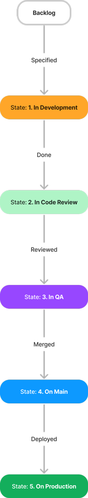
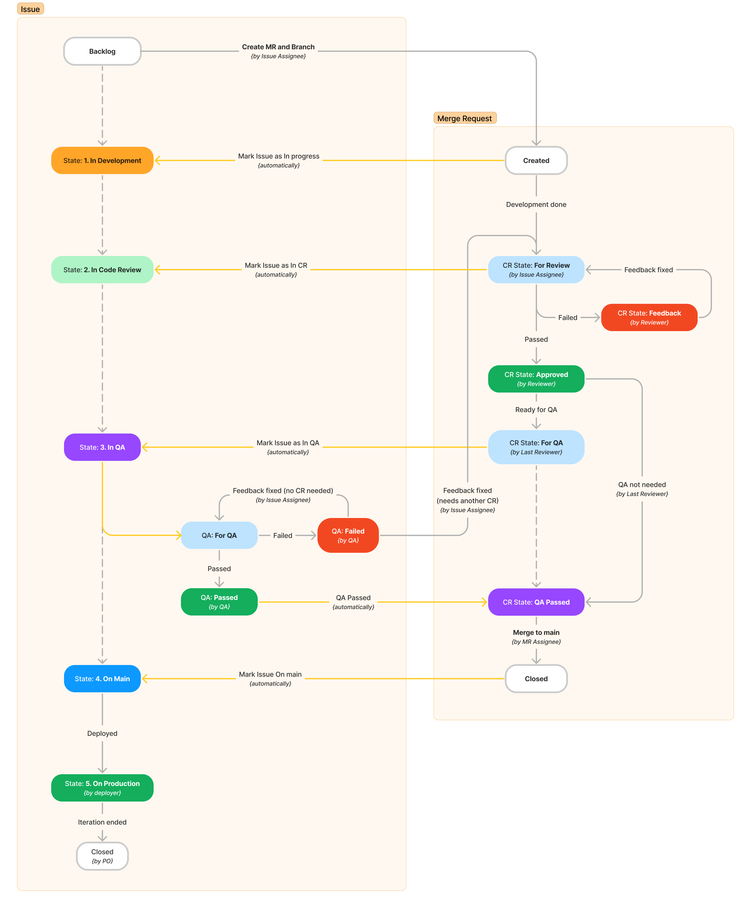
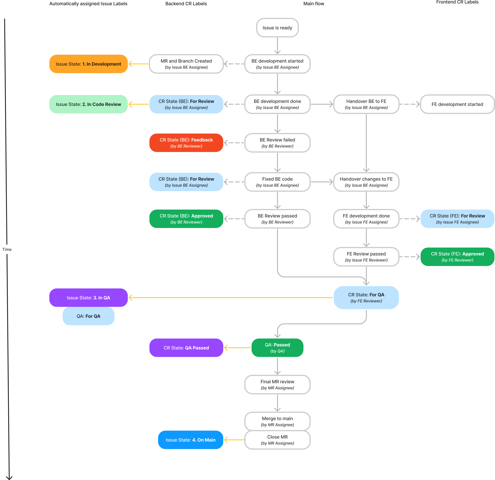
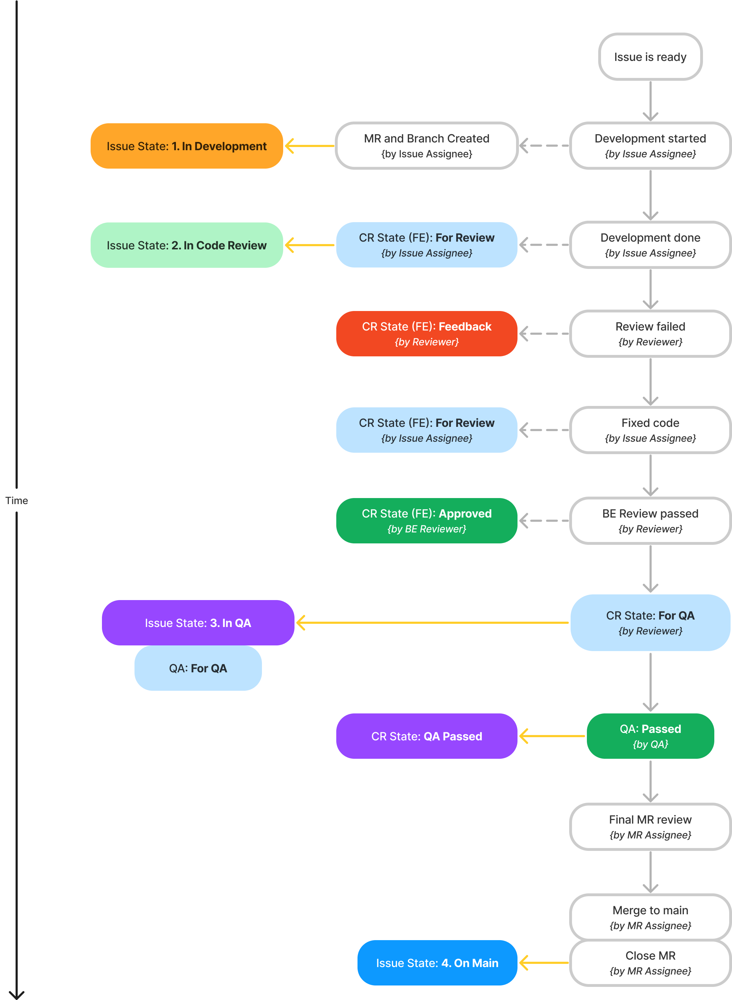

# 🏷️ Issue Labels

# Roles

*There are several roles of users that participates in the Issue lifecycle. This is their definition to understand who does what in the following document.*

### Issue Author

Author of the Issue. They are responsible for providing complete and comprehensive description of the Task.

The Issue Author should be part of the QA or UAT process to validate (in addition to the *QA Engineer*) that the Task was implemented correctly.

*Can be anybody, but typically will be the Product Owner and Developer for new Features, QA for reported Bugs or a Developer for refactoring tasks.*

### Issue Assignee

Issue Assignee(s) are the people responsible for making the Task done.

*Typically will be a Developer.*

### QA Engineer

Person responsible for making sure, that the Task was prepared according the [Specifications](./Specifications.md) and the Acceptance criteria.

### MR Assignee

Merge Request Assignee is responsible for delivering quality code. There is more detailed description in [Merge Request Roles](https://iguana.wiki./Git%20Strategy.md#h-merge-request-roles).

*Typically will be a Senior Developer. In a lot of cases the same person as Issue Assignee.*

### Reviewer

Person responsible for doing the [Code Review](./Code%20Reviews.md).

*This will be a Developer, other than Issue Assignee.*

# Issue State Labels

State Labels describes in which state the Issues is currently in the meaning of progress from it's conception to its delivery.

:::info
Issue State Labels should be assigned on to the Issues (not on Merge Requests).

:::

## No State Label

Meaning that the Issue is still being drafted by its *Author* or is generally not ready to be picked up by Development.

 

## State: 1. In Development

Task is currently in active development process.

### Prerequisites

* Estimate (scoping) is done and provided in the Issue by the *Issue* *Assignee*.
* Feature branch is created and linked to the Issue by the *Issue* *Assignee*.

## State: 2. In Code Review

At least some part of the code was handed over for [Code Review](./Code%20Reviews.md) by the *Issue* *Assignee*.

To see specific [status of the CR](https://iguana.wiki/doc/issue-labels-CtaAl2Z95w#h-code-review-state-labels), please go see the status of the linked Merge Request.

### Prerequisites

* All tests are implemented by the *Issue* *Assignees* and passing.
* Everything is implemented by the Assignees according to the Specifications (at least their part of the work).

## State: 3. In QA

Task has been completely reviewed and is ready for the QA and UAT process.

### Prerequisites

* All feedback was implemented by the *Issue Assignee* and approved by the *MR Assignee*
* Linked Merge Request has all necessary `CR State: Approved labels`

## State: 4. On Main

The Issue and its branch was merged to `main`. Issue is ready to be deployed to Production.

### Prerequisites

* All QA and UAT feedback was implemented.
* All tests are still passing.
* Feature branch was deleted and all Git commit messages are according to Conventional Commits.

## State: 5. On Production

The Issue was deployed to Production servers.

### Prerequisites

* The Issue should be part of the [Release notes](./Releases.md).

## Closed

The Issue is closed by the *Product Owner* when reviewing ending Iteration and planning a new one.

### Prerequisites

* The Issue has been deployed to Production and there has not been any major problems with it.

# Issue Lifecycle flow

This diagram describes the whole lifecycle of an Issue together with its linked Merge Request.

 

# Code Review State Labels

CR State Labels in which state is the related [Merge Request](https://iguana.wiki./Git%20Strategy.md#h-merge-requests).

:::info
Code Review State Labels should be assigned on to the Merge Request only (not on Issues).

:::

There are separate group of labels for **Backend** and **Frontend** developers. If the Merge Request requires changes in both parts of the application, the Merge Request is considered approved, only if both BE and FE are both approved.

The flow and the states are identical for Frontend and Backend Reviews. For simplicity, the states are described together here.

## No CR State Label

Meaning that the code is still being worked on. The Issue State label is [State: 1. In Development](https://iguana.wiki/doc/issue-labels-CtaAl2Z95w#h-state-2-in-code-review).

## CR State: For Review

At least some part of the code has been fully finished by the *Issue Assignee*, and is ready fo the *Reviewers* to be [reviewed](./Code%20Reviews.md).

When there is at least one CR State Label **For Review**, the Issue Label should be changed to [State: 2. In Code Review](https://iguana.wiki/doc/issue-labels-CtaAl2Z95w#h-state-2-in-code-review).

## CR State: Feedback

The Code Review has not passed and there is feedback left in the Merge Request for the *Issue Assignee* to fix or explain.

When the *Issue Assignee* has addressed the feedback completely, they will switch the CR State label back to **For Review**.

## CR State: Approved

The *Reviewer* is fully satisfied with the changes in MR and marked the Code Review as approved.

If all CR States are approved, the code is ready to be merged from the development point of view.

## CR State: For QA

All Code Reviews are done and approved (in case Backend and Frontend changes are done in the same MR).

The Issue Label will be changed to [State: 3. In QA](https://iguana.wiki/doc/issue-labels-CtaAl2Z95w#h-state-3-in-qa) and QA: For QA.

## CR State: QA Passed

The *QA Engineer* fully checked the Issue and everything has passed.

Or if the *Reviewer* thinks that QA is really not needed in this case, they can skip QA process and assign this label directly. It is always *MR Assignees'* responsibility to make sure, that QA was really not needed and everything can be merged to `main`.

## Example: Merge Request with Backend and Frontend development

 

## Example: Merge Request with Frontend development only

 

## Related Label Guidance

For rules about tracking refactoring and technical-debt work, see [Refactor Label](https://iguana.wiki./Issue%20Labels/Refactor%20Label.md).