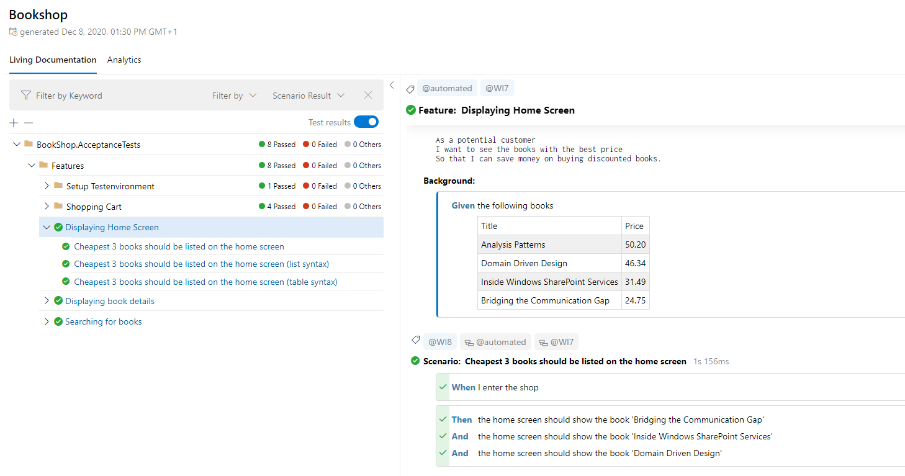

# ✍️ Specifications

## [Link to Epic Specs Template](https://gitlab.praguelabs.com/groups/nomiverse/campiri/-/epics/65)

*WIP*

Since we want to practice [Behavior Driven Development](https://cucumber.io/docs/bdd/) (BDD) it is important to align our mindset to couple key values and processes.

# Behavior Driven Development

**Product Owner** is fully responsible for creating the specifications. But that doesn't mean that it is a required to take upon this task by them selves alone.

We have proven in real world development, that it is beneficial to invest more energy in the **discovery phase** of product specification, particularly by involving other roles to the process. Typically a developer, designer and QA engineer. To help explore most new Features and User Stories we practice [Example Mapping](https://cucumber.io/docs/bdd/example-mapping/).

Though *Example Mapping is not ideal solution for exploring any problem* there is, we have learned couple key takeaways, that are possible to implement into *any type of specification workflow*:

## Provide specific Examples

Communicate using specific examples and make use of them in the documentation.

That way we can improve the odds, that both:

* the **dev and design team** knows exactly what is asked of them to create, as well as that;
* the **business team** is able to provide meaningful feedback and *approve* that the *product solution* we are proposing, is going to actually help them.

:::tip
Keeping specifications too abstract will often lead to everybody imagining the final product way different.

:::

## The Three Amigos

Verifying ideas and the full extent of the product ideas with coworkers of different roles yields **more specific questions** and **edge cases**, one person is typically not able to **discover** by them self alone.

* It is more efficient to spend more of the team's time in the specification phase (discovery) - opposite to finding about more or less impactful question during the development and trying to get answers while the whole process and sprint is ongoing. Let alone having to redo some parts of the code because the User Story changed or was incomplete.
* Keep in mind that we still want to **stay agile**. The goal is to take only a **small User Story** and try know all possible questions before the specifications are finished. We want to **avoid adding more features** by creating a perfect product on the first try!

## Specify the expected Behavior not the Solution

The Product Owner is fully responsible for doing the product research, gathering all necessary business requirements and finally creating good specifications. But what we want to typically avoid, is specifying how the product problem should be actually solved.

In most use cases it best to leave it up to the UX and UI team to decide, what kind of buttons and interface and interaction patterns the User story will require and actually let the responsible developer to come up with the best technical solution for achieving the Story goals.

In other words, we should be very deliberate to perfectly specify the **expected Behavior** of the product, and provide enough context for the team to solve the assignments. We don't want to specify, how to implement the solution in the product specifications. That is a goal of the technical specifications and should be done on the Issue level with cooperation of a Developer.

:::info
See full description of [Product Owner role and their responsibilities](/doc/roles-description-k0g2QnEwAA).

:::

## Testing Scenarios and Acceptance Criteria

Product Owner is responsible for having good **Testing Scenarios** (TS) and **Acceptance Criteria** (AC) **before the Task is handed over for development**.

* Testing Scenarios will typically be created by or with the cooperation with an QA Engineer or a Developer.
* Acceptance Criteria should be typically done by the PO as they should reflect the business needs and describe the required product behavior on the top level.

Both the TS and AC are created while doing Example Mapping. Even if the Mapping is not utilized for a given Task, TS and AC needs to be provided anyway.

## Executable Specifications

As a result of the specified Features and Testing Scenarios we want the dev and the QA team to write those in [Gherkin](https://cucumber.io/docs/gherkin/reference/) syntax in *.feature* files. The goal of Gherkin is to have a way, how to document a test scenario in a way, that is both **understandable by non-technical people** having the knowledge of the business and be **utilizable by the developers** to actually implement the automated test with it.

Thanks to that and the way we have our automated tests implemented, the CI pipelines should produce **latest reports** with:

* all the **Features** we are testing (ideally we should have all important featured covered by automated tests);
* all **Testing Scenarios** for each Feature with human readable description;
* status of implementation or actual **result** of each TS.

This provides the **Product Owner** with the ability to easily and **systematically check**:

* on the **development progress** of a Feature in progress;
* see that all existing **Features are still working**;
* maintain a good and up to date **documentation** of the product capabilities with **single source of truth**.

 

# TODO: spec flow

* flow of how specs are made

…

* **==Epic==** ==is the entire description of the target state. That is, a description of the complete group of features.==
* **==Issues==** ==issues are individual tasks/features within an epic. Each issue should be a separate BE and FE unit that can be merged into the main! (not just, for example, a prepared domain or cqrs, ..) Issue must always be as small as possible so that they meet this condition.==

# General development flow

1. Epic gets **divided to smaller Issues** ([see examples](#h-examples-how-to-split-epic-into-issues)).
2. Every Issue is a separate [Feature branch](./Git%20Strategy.md).
3. Each Feature branch is **tested and released separately**.
4. Frontend features are hidden with [Feature flags](./Git%20Strategy.md) if necessary.
5. Once the whole Epic is tested and accepted as a whole, we will enable all features from the Epic to selected group of customers for first wave of testing on Production.
6. If the trial goes well, we will remove the Feature flag from code a effectively **release the whole Epic** to everybody on Production.

# Examples: How to split Epic into Issues

## Example 1

Let's take this Epic as an example: [Availability Calendar for Operators](https://gitlab.praguelabs.com/groups/nomiverse/campiri/-/epics/42)

Let's assume ***non ideal scenario***, when the design is not 100 % finished at the time of development handover and we agree that we will **start ahead with backend** development and **fronted will catch up** once the design is done.

For that reason, we will split creating API endpoints and the their actual implementation in the frontend application into separate Issues. Otherwise we would probably get a stale branch (multiple weeks) with the prepared API (`#1`) waiting long time for the frontend part to be picked up). Any adjustments and fixes on API will be done in the new branch (`#7`) which delays with implementing the calendar feature.

* `#1: API: Modify Listing availability`
* `#2: API: Get Listing unavailability events`
* `#3: Custom calendar component`
  * We want to render a simple calendar UI with no features
* `#4: Custom interactive calendar`
  * We want to add ability to display events and select days
* `#5: Display events from API in Availability calendar`
  * Utilize custom calendar component
  * API adjustments if needed
* `#6: Add ability to view Reservation details in Availability calendar`
* `#7: Add ability to modify availability in calendar for Operators`

## Example 2

Let's take same Epic: [Availability Calendar for Operators](https://gitlab.praguelabs.com/groups/nomiverse/campiri/-/epics/42)

This time design is finished on time for the development handover. We can synchronize and deliver whole features between backend and frontend team.

We still should consider if those features should be split for separate Issues for backend and frontend team based on our prediction of team availability.

* `#1: Custom calendar component`
  * FE: We want to render a simple calendar UI with no features
* `#2: Custom interactive calendar`
  * FE: We want to add ability to display events and select days
* `#3: Display events from API in Availability calendar`
  * FE: Utilize custom calendar component
  * BE: API endpoint for getting unavailability events
* `#4: Add ability to view Reservation details in Availability calendar`
  * FE: Display Reservation details in the right column
  * BE: Adjust API for viewing Reservation details
* `#5: Add ability to modify availability in calendar for Operators`
  * FE: Form for editing and creating Listing availability
  * BE: API for modify Listing availability

\