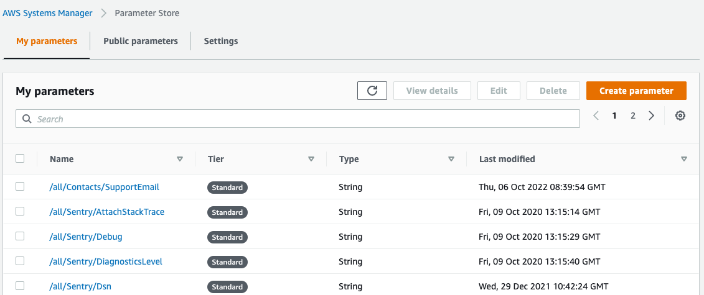

# Environment Variables

# Intro

The following article describes the rules, processes, and implementation of how the project developers should handle environment variables and secrets for both backend applications.

Anything that can be assumed as a **secret** variable **must not ever be committed to git history** at all costs, if such a thing happens, the responsible person needs to handle **revoking** of such **secrets** and **issuing new ones**.

# AWS Parameter Store

We do utilize heavily an AWS service called System Manager which contains a Parameter Store service. It is something like your password manager, except for programmatic use. 

## What is it for?

It is a store for any application configuration, secret, or variable you need to store securely and perhaps have different values for different environments.

## How do I use it?


1. You need to contact your DevOps engineer, it will probably be Milutin Kubik. He will give you access to AWS Console for the project on which you are working. 
2. After login in you go to Services → System Manager → Parameter Store.
3. Now you can start adding/editing variables. Be aware that any change is very rapidly propagated to all environments, so do not for example change production settings unless you really want to change them.
4. The variable names are constructed by paths in the following pattern `/{ENVIRONMENT}/{SECTION}/{SECTION}/…/{NAME}`. 

 

# C# providers

Dotnet applications use a setup of 3 primary sources of environment variables:

* public `appsettings.json`
  * hold variables that can be committed to git history, and contains basic dotnet setup
* Parameter Store by Amazon
  * configuration is registered for all available environments in given order where the most general (not environment specific) is being overridden by the concrete environment variables
    * basic credentials setup to Parameter Store holds access `all (general)` and environment-specific `prod`
* user secrets `secrets.json`
  * secret variables and developer personal adjustments (overrides)
  * holds configuration to access the Parameter Store
  * the user secrets are registered twice due to the following reasons
    * first registration provides the access credentials for the Parameter Store
    * seconds registration overrides anything before (personal adjustments)

**Sources priority are configured as following**


1. `appsettings.json`
2. `secrets.json`
3. Parameter Store
4. `secrets.json`

The last registered source overrides the previously registered sources.

**Configuration builder example**

```csharp
public static IConfigurationBuilder GetConfiguration( )
{
    ConfigurationBuilder builder = new ConfigurationBuilder( );
    string storeAccessKey, storeSecretKey, storeRegion;

    builder.AddJsonFile( "appsettings.json" );
    builder.AddEnvironmentVariables( );
    builder.AddUserSecrets<Program>( );

    {
        //get the store credentials
        var config = builder.Build( );
        storeAccessKey = config.GetValue<string>( "ParameterStore:storeAccessKey" );
        storeSecretKey = config.GetValue<string>( "ParameterStore:storeSecretKey" );
        storeRegion = config.GetValue<string>( "ParameterStore:storeRegion" );
    }

    if( !string.IsNullOrWhiteSpace( storeAccessKey )
      && !string.IsNullOrWhiteSpace( storeSecretKey )
      && !string.IsNullOrWhiteSpace( storeRegion ) )
    {
        AddParameterStorePath( builder, "/all/", storeRegion, storeAccessKey, storeSecretKey );
        AddParameterStorePath( builder, "/dev/", storeRegion, storeAccessKey, storeSecretKey );
        AddParameterStorePath( builder, "/stage/", storeRegion, storeAccessKey, storeSecretKey );
        AddParameterStorePath( builder, "/prod/", storeRegion, storeAccessKey, storeSecretKey );
    }

    builder.AddUserSecrets<Program>( );

    return builder;
}
```

# **Initialization of user secrets**

**Rider**: Project context menu → Tools → Initialize Project user Secrets / Open Project User Secrets

**Visual Studio**: Project context menu → Manage User Secrets

**Content of** `secrets.json`

```json
{
  "ParameterStore": {
    "storeAccessKey": "******************",
    "storeSecretKey": "******************",
    "storeRegion": "******"
  }
}
```

# Binding of variables

Once you have registered your providers you can easily bind them to a C# class to access them more easily from the DI scope.

```csharp
public static void BindAppSettings( this IServiceCollection services, IConfiguration configuration, AppSettings appSettings )
{
  var appSettingsSection = configuration.GetSection( "AppSettings" );
  services.Configure<AppSettings>( appSettingsSection );
  appSettingsSection.Bind( appSettings );

  services.AddSingleton( appSettings );
}
```

The path from Parameter Store and as well the JSON structure from your `appsettings.json` or `secrets.json` is a representation of how the `AppSetting` class is structured, so the mapping is done 1:1.

```csharp
public class AppSettings 
{
  public Contacts Contacts { get; set; }
  public Sentry Sentry { get; set; }
  // ... and more
}
```