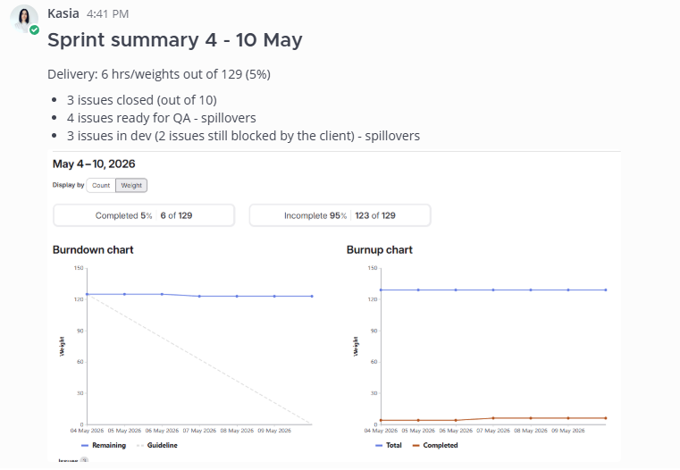

# Kasia's handover

# SPRINT

* Initial sprint rules you can find [here](https://iguana.wiki./Sprint%20rules.md)
* Before the sprint planning I was gathering the capacities and time of known meetings from the team [here](https://docs.google.com/spreadsheets/d/1Ld9z7yMxJbs2E4-4plrKK3NdENefao-7Mj7NG5vrgiQ/edit?gid=434472550#gid=434472550)
* According to the capacities I was planning the issues basing on the backlog from PO for the following projects (the boards linked):
  * [Propeller](https://gitlab.iguana.tools/propeller/propeller/-/boards/259?iteration_id=1195)
  * [Carivio](https://gitlab.iguana.tools/nomiverse/carivio/carivio/-/boards/253?iteration_id=1219)
  * [Edri global](https://gitlab.iguana.tools/e.on/edri/edri.com/-/boards/263?iteration_id=1222)
  * [Campiri](https://gitlab.iguana.tools/nomiverse/campiri/campiri/-/boards/256)

* Before end of the sprint I was asking the devs to add "Missed iteration" label to the issues which won't be closed within the sprint. Thanks to that it is easier to prepare the sprint summary (next bullet point)
* Every Monday I was preparing the Sprint Summary [here](https://docs.google.com/spreadsheets/d/1SExl6pdS5SXVO5zytNUrtM4hK6ukop-mtAupprV5Sp8/edit?gid=187565161#gid=187565161) and posting the short summary for the devs on the channels. The burnup chart you can find here for e.g. for [Campiri](https://gitlab.iguana.tools/nomiverse/campiri/campiri/-/cadences): 

  \
  

# EDRI (handed over to @[Štěpán Unar](mention://67f0f444-ac85-43cb-a929-bfc49d4e40f5/user/b0ae7bcb-a42f-4d98-8b2d-2d172d359319) )

* There is one topic I was involved in and which is still not delivered because of the client's lack of responsiveness -→ Site Tracker integration with the contact form on the website and Review app where the contact form submission will land before it will be moved to Site Tracker
  *  GL issue: <https://gitlab.iguana.tools/e.on/edri/edri.com/-/work_items/45>
  * This feature is partially Paid from the initial Website redesign budget (Site Tracker integration part)
  * We have the separate budget for the Review App part - budget guard [here](https://tracker.iguana.tools/clients/EI/budget-guard/RoFW8UZZwi5gccsgCiTL).
  * What is missing is the confirmation of the fields mapping. You can follow up on this [here](https://edricom.slack.com/archives/C09TQH9QN07/p1778664526841059).
* The feature above must be done together with the [following issue](https://gitlab.iguana.tools/e.on/edri/edri.com/-/work_items/81) as the topic is connected. We informed the client that this activity will take us 7hrs and the cost will be approx. 388 EUR (but we are tracking this activity under the edri.com extra hourly and it should be normally added to the invoice issued monthly)
* Ebru from Edri asked us to add all the extra issues we are doing to one file so she can keep an eye on the costs, so I gathered them [here](https://docs.google.com/spreadsheets/d/16UDmqSQgs2p-Sn0h9tpvFQ1jdlGDtyRoJq6Ukmi6eMs/edit?gid=0#gid=0). From some time Stepan took over. Ebru has the access to this file.
* My playground to calculate the costs (rates are there) is [here](https://docs.google.com/spreadsheets/d/1joCZu3XYcwSIKI3yGHzOoR9bKE1PCd3UUxf2P5K-rWo/edit?gid=445268881#gid=445268881). 
* Edri website prod: <https://www.edri.com/>
* Edri admin prod: <https://www.edri.com/admin>
* Edri website staging: <https://staging.edri.com/>
* Edri admin staging: <https://staging.edri.com/admin>

  \