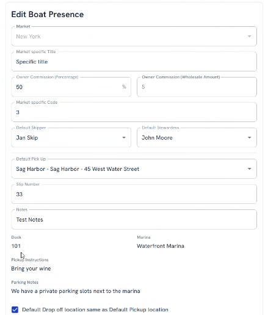
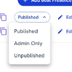
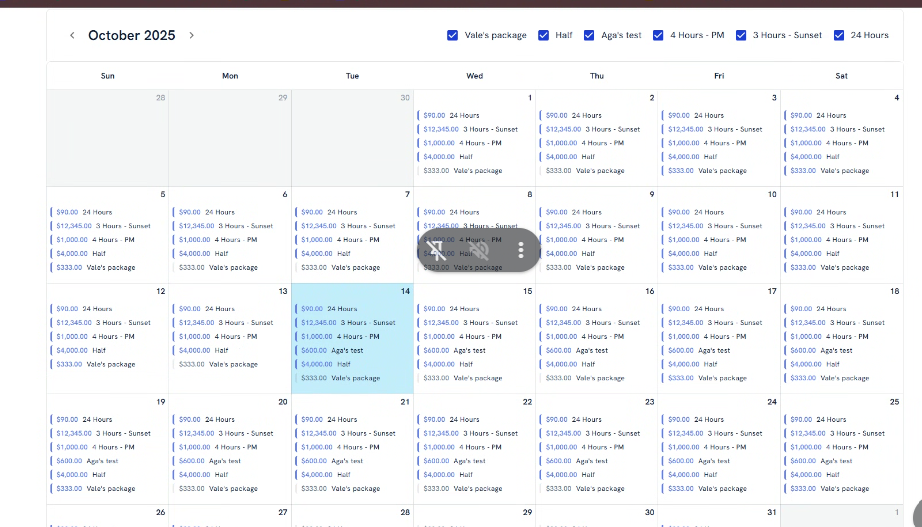
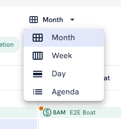
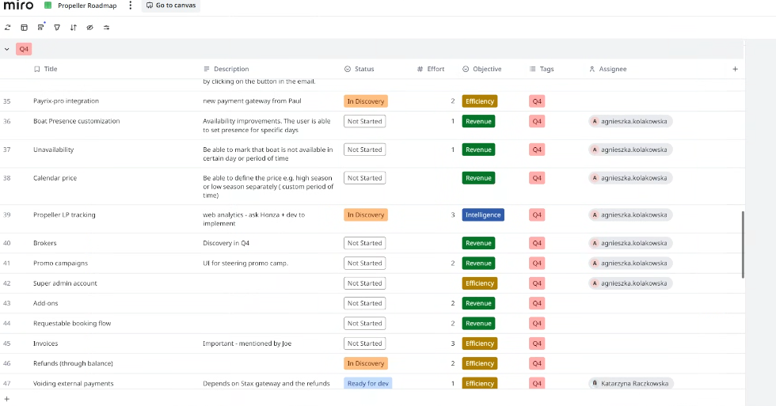

# Propeller intro

2 markets \[Widget is used on all the websites → we know from which website it was used\]

**New York :** <https://yachthampton.com/> + Hamptons Boat Rental + Elypsis 

* high season: 1.05-31.09
* weekends are packed (mondays are not booked almost at ALL, other weekdays also less popular_

**South Florida :** <https://southfloridayachtrental.com/> : Propeller → prices/availabilities visible in widget; boats from wbesite are mapped to Propeller boats so it matches; but whole website content is maintained separately; 

* high season: NYE + winter (but smaller business in general than NYE)

**LOCATIONS**

Locations are : different harbours, different addresses, different docks

**BOATS**

**Boat Presence**

* No dates possible to be set up per Boat Presence
* Migrating Boats between different markets

 

 

\
**Price Package** → it's only defining the slot and hours etc etc. ; should be renamed as Price is not defined at this step : what would be good name ?? we should refer to time/duration;

**Boat Pricing** → this is where price is set; we can define the order how it's displayed on the website; base price and also additional fees are set here; 

**Availabilities**

* Reservation - always blocks the availabilities
  * Unpaid reservations created by Admins are blocking the availabilities
  * Paid reservations created by Admin or Client are blocking the avilabilities
* Offer - not blocking the availabilities , OR blocking availabilities for 24h - if marked by Admin when Offer was created; 
* Enquiry - created at the moment when booking widget step 2 (customer data) is completed (=payment step opened); not blocking the availabilities; Admin can create Offer out of it or add payment to convert it to Reservation;
* Postponed - not blocking the availabilities anymore; 
* Cancelled - not blocking the availabilities anymore; 
* Declined - not blocking the availabilities anymore; Offer or Enquiry can be moved manually to declined

At bottom of the Boat details page: calendar - noone uses it at the moment, could be possibly reused for unavailabilites?

 

The boat details page: new designs will be implemented - they are starting from it (!!) → <https://www.figma.com/design/OlItjvgteFqTPZMDDLVyOg/Main-Flow?node-id=7774-18078&t=P3utQVsGreHYjwRh-0>

**Bookings Calendar**

Calendar in top navi in Admin:

<https://app.staging.mightypropeller.com/admin/bookings/calendar>

* All bookings visible per each day
* Possible to add notes - curretly used for staff unavailabilities or hurracaine notes
* (!) - not paid / partially paid (action required!!); ($) - paid;
* Orange dot - skipper not set; location not set (action required!!)
* Enquiries and Offers also visible in the calendar (even though they are not blocking availabilities !!) \[some Offers would be blocking availabilities soon for 24h\]
* There are 4 views:

  

**Availability Calendar**

Availability in top navi in Admin:

<https://app.staging.mightypropeller.com/admin/availability>

* Monstly used for finding free slots to sell them

\
**Roles:** Admin, Sales People, Skipper, Stewardess

**Sales People:**

Staging account: 

[propeller.salesperson@praguelabs.com](mailto:propeller.salesperson@praguelabs.com)

2feTZy45Bqt}/{P

* they see Calendar/Bookings/Availability/Boats/Customers in top navi;
* in general access to everything in the above tabs;

**Skippers/Stewardess:**

Staging account:

[propeller.skipper@praguelabs.com](mailto:propeller.skipper@praguelabs.com)

2feTZy45Bqt}/{P

* they only see only Calendar/Bookings/Boats in top navi;
* in Bookings/Calendar tab they see only the Bookings they are assigned to;
* in Boats they see all the Boats;

\

**Roadmap Prios - Aga to discover and specify:**

1. Unavailability \[only Admins should be able to steer; Sales People should be able to see those; Skippers/Stewardess should not be able to see those nor steer those;\]
2. Boat presence
3. Pricing \[NEEDED: high season vs low season pricing steering; right now it's possible only on weekdays;\]

 

\