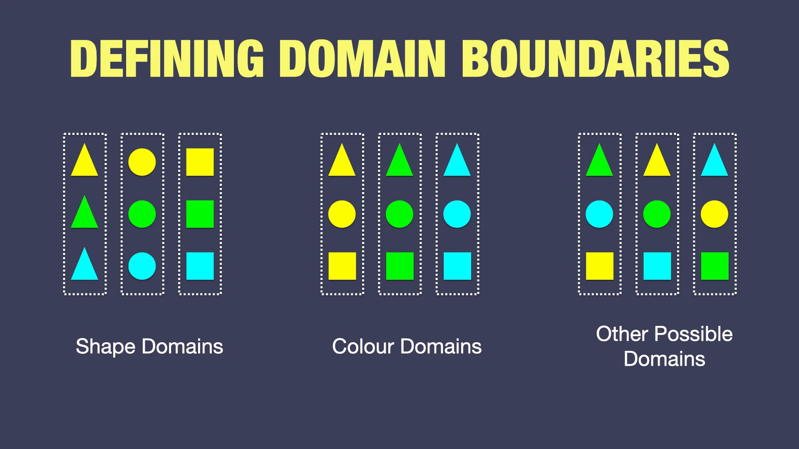
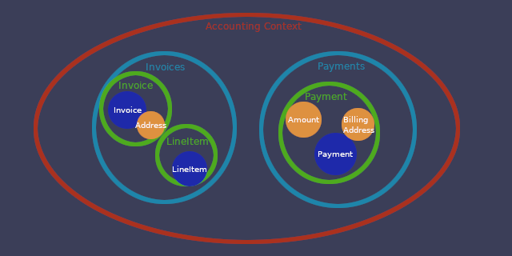

# Domain-Driven Design

## Table Of Contents

* [Pros and Cons](https://iguana.wiki/doc/ddd-kP6Cdim6em#h-pros-and-cons)
* [Fundamentals](https://iguana.wiki/doc/ddd-kP6Cdim6em#h-fundamentals)
  * [Bounded Context](https://iguana.wiki/doc/ddd-kP6Cdim6em#h-bounded-context)
  * [Ubiquitous Language](/doc/ddd-kP6Cdim6em)
  * [Domain](https://iguana.wiki/doc/ddd-kP6Cdim6em#h-domain)
  * [Events](https://iguana.wiki/doc/ddd-kP6Cdim6em#h-events)
  * [Shared Kernel](https://iguana.wiki/doc/ddd-kP6Cdim6em#h-shared-kernel)
  * [Domain Types](https://iguana.wiki/doc/ddd-kP6Cdim6em#h-domain-types)
  * [Aggregates](https://iguana.wiki/doc/ddd-kP6Cdim6em#h-aggregates)
  * [DDD Structure](https://iguana.wiki/doc/ddd-kP6Cdim6em#h-ddd-structure)
* [Relevant Concepts](https://iguana.wiki/doc/ddd-kP6Cdim6em#h-relevant-concepts)
* [Learning Material](https://iguana.wiki/doc/ddd-kP6Cdim6em#h-learning-material)

## Pros and Cons

### Why DDD

* Separating logic into smaller managable parts, suited for complex lasting projects
* Performance & Scalability
* Clear communication and discussion

### Challenges

* Data synchronization
* Slower project kick-offs
* Requires educated/experienced team

## Fundamentals

DDD stays for Domain-Driven **Design**, it is not just a tech development approach, it specifies more than just programming concepts and principles. It defines processes in which whole team cooparates, including product department, design department, stakeholders, and whoever else is involved in the project.

The DDD premise, is that the whole development is driven by business, it separates business processes into contexts (like accounting, analytics, marketplace, etc.) which are independent and implement their own shared language (ubiquitous language).

This model is then reflected in the product via design and code, using the ubiquitous language and contexts separation.

### Bounded Context

The purpose of bounded contexts is to separate complex business into smaller managable parts. Each part is fully independent, which helps the team to focus on specific problems. Additionally, teams can define their own processes/tech-stack/development as they are fully independent from others.

:::info
This is a dramatic change from how usually monolith projects work and changing way of thinking takes more than just a day, sometimes helps trying to think of the bounded context as a project of it's own. And visualize them as separate boxes.

:::

So how to decide, what bounded contexts the business has and where to draw the line? Let's use [this analogy by Nick Tune](https://medium.com/nick-tune-tech-strategy-blog/domains-subdomain-problem-solution-space-in-ddd-clearly-defined-e0b49c7b586c). We have several areas our business deals with (e.g. payments, invoices, listing product, etc.) how do we decide how to categorize them into contexts?

 

 

There will always be some overlap and therefore the context boundaries might be a bit fuzzy. Remember, the business is driving the bounded contexts, and more departments can be interested in same area (like invoicing, for accounting and customer service) but both context have different way of interacting, they work with the resources in their own context, independently. Therefore, one system feature can be implemented in multiple bounded contexts but they are split by the business processes. For example, customer service can resend the invoice to customer, while accounting can invalidate the invoice. We must identify these use cases and split them into bounded contexts accordingly.

### Ubiquitous Language

Ubiquitous language is a set of terms that are used to describe the common language of the business **within the context**. Whole team must agree on it so it is consistent and understandable across all team roles. For example, accounting team must all understand that collecting money from a customer is called `Payment` as oppose to `Charge`, so product, design, development, and any other department involved in the process implement the correct term (nothing worse, than having different terms in frontend application, backend application, design, and specifications).

### Domain

We mentioned an "area" already few times. In DDD the bounded contexts consist of domains (*area of interest*), domain is a specific problematic that someone in the business deals with, domain are mainly used in tech development to organize the code into logical spaces. Good examples are invoices (in accounting bounded context), pricing (in marketplace bounded context), orders (ordering bounded context), customers (ordering bounded context), etc.

:::info
Domains are great candidates for defining a microservice scope, which has same size and context as the bounded context but is independently deployable.

:::

### Events

Domains and bounded contexts need a way to communicate with each other. In order to follow SOLID principles, we want the connections to be loosely coupled. For this reason we use Pub/Sub pattern, where the domain publishes events and other domains can subscribe to them.

There are two types of events, **Integration Events** and **Domain Events**.

**Domain Events** are used to communicate within the bounded context boundaries and run in the same transaction. Either all handlers pass or all fail.

**Integration Events** are used to communicate between bounded contexts. They are published from the domain event handler and are sent to the message broker (e.g. RabbitMQ, Kafka, etc.) and then consumed by other bounded contexts.

[Detailed Learning Material for Domain Events](https://learn.microsoft.com/en-us/dotnet/architecture/microservices/microservice-ddd-cqrs-patterns/domain-events-design-implementation)

### Shared Kernel

Shared Kernel is a concept in DDD that allows to share common code subset between bounded contexts. This subset typically includes common data structures, utility classes, integration events, and so on.

### Domain Types

To represent the domains in code, we use two types of classes, **Entities** and **Value Objects**.

**Entity** definition is, a mutable object with lifecycle. Generally the rule is, if it has an ID or it can change in time (e.g. it has a status), it's an entity.

**Value Object** on other hand, is immutable without identity. It's a factual data, for example address, color, etc. red color will always stay red, if someone wants to change it they change the whole color object for different one.

### Aggregates

Finally last piece of puzzle, **aggregates** are group of entities and value objects, that altogether solve some problem, there can be multiple aggregates per domain, the important part is, that aggregates can be accessed only via \**Aggregate Root* which is always an **Entity** with globally unique identifier (GUID). This aggregate root ensures, that all changes to the aggregate are valid within the context of whole aggregate.

### DDD Structure

Using all the concepts we can model the whole business logic and build independent systems.

   

[Figma Example Diagram](https://www.figma.com/board/4r9xyKRJKSDmdgH249RNpw/DomainFramework---Bounded-Contexts-Example)

## Relevant Concepts

* Repositories (isolating domain logic from data persistence)
* Services (fulfills operations that need to coordinate across multiple aggregates)
* CQRS
* Clean Architecture
  * Presentation Layer
  * Infrastructure Layer (Presentation Layer dependency for DI)
  * Application Layer
  * Domain Layer

## Learning Material

* [Listen to DDD AI Podcast by NotebookAI](https://gitlab.praguelabs.com/pts/PTSdomainFramework/-/raw/master/assets/DDD%20AI%20Podcast%20by%20NotebookAI.wav)
* [Domain-Driven Design Course by Amichai Mantinband](https://www.youtube.com/playlist?list=PLzYkqgWkHPKDpXETRRsFv2F9ht6XdAF3v)
* [Domain-Driven Design by Eric Evans](https://www.amazon.com/gp/product/0321125215/ref=as_li_tl)
* [Hands-On Domain-Driven Design with .NET Core by Alexey Zimarev](https://www.amazon.com/Hands-Domain-Driven-Design-NET/dp/1788834097)